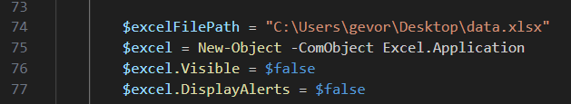

# Excel Data Processor NCIA CSU

##### Version: 0.0.1
##### Date: 2021-09-15
##### Author: Gevorg Minasyan
##### Owned by: NCIA CSU

## Overview

This PowerShell script processes data from a text file and writes it to an Excel worksheet. It creates a graphical user interface (GUI) with a form to guide users through the data processing steps. The GUI contains a label for instructions, a process button, a checkbox to determine whether to clear the content of the source file, and a text box for output messages.

## Setup 

######  Change the excel file directory on line 74.

### Troubleshooting and syntax

###### Be sure the syntax of the scanner is like this.

>22/09/2004,21:26:27,NCIA666666
>22/09/2004,21:26:34,L8.6.035
>22/09/2004,21:26:52,ABC209

>22/09/2004,21:26:27,NCIA77777
>22/09/2004,21:26:27,NCIA77777
>22/09/2004,21:26:27,NCIA77777
>22/09/2004,21:26:27,NCIA77777
>22/09/2004,21:26:34,L8.6.035
>22/09/2004,21:26:52,ABC209

